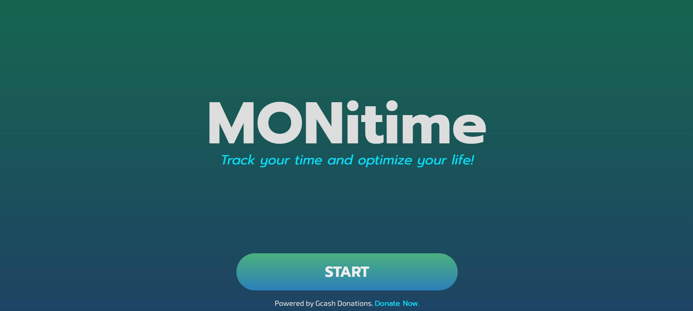

<!-- Improved compatibility of back to top link: See: https://github.com/othneildrew/Best-README-Template/pull/73 -->

<!-- PROJECT LOGO -->
 

<h1 align="center">rMONitime v1</h1>

  

    A time monitoring app for personal use running on browser.
     
    <a href="https://aramind-monitime-app.netlify.app/" target="_blank" >MONitime v1</a>
  

<!-- ABOUT THE PROJECT -->

## About The Project

During my immersive experience in a full stack web development bootcamp, I
embarked on building this remarkable project. Its primary objective was to apply
the extensive knowledge and skills acquired throughout the bootcamp, with a
particular focus on honing my proficiency in the React.js framework. Notably,
this project stands as a testament to the power of client-side development, as
it operates without the need for a dedicated backend infrastructure. Despite
this, I ensured that data persistence was achieved seamlessly through the
utilization of the browser's local storage capabilities.

### Built With

- HTML5
- CSS3
- Javascript
- ReactJS

## License

Distributed under the MIT License. See `LICENSE.txt` for more information.

(<a href="#readme-top">back to top</a>)

